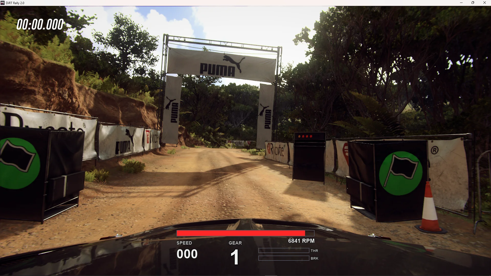

# CustomRallyDash — Telemetry Dashboard for DiRT Rally 2.0

**CustomRallyDash** is a lightweight, real-time telemetry dashboard and HUD for **DiRT Rally 2.0**. It decodes 60 Hz UDP (`Extradata=3`) packets from the game's physics engine and renders low-latency visual instrumentation — supporting compact digital HUDs, circular analog tachometers, borderless Windows click-through overlays, and Raspberry Pi GPIO shift lights.



---

## Features

- **Dashboard Layouts**: Modern horizontal digital bar HUD and circular analog gauge with dynamic redline detection.
- **Windows Overlay**: Transparent, click-through overlay with `alpha` and `chroma` compositing modes that stays on top during gameplay.
- **Motorsport Themes**: Interactive theme selector with curated presets (`Modern Dark`, `Subaru WRC`, `GT3 Racing`, `Night Neon`, `Retro Amber`).
- **Mock Telemetry Broadcaster**: Standalone 60 Hz synthetic packet generator modeling WRC acceleration, sequential shifts, and trail-braking for offline testing and tuning.
- **Hardware Shift Lights**: Physical LED integration via Raspberry Pi GPIO (`gpiozero`).
- **Zero-Bloat Configuration**: Plain Python configuration files (`config.py` for system/runtime, `settings.py` for UI/styling).

---

## Requirements

- **Python**: `3.11.x`, `3.12.x`, or `3.13.x` (Python 3.14+ is currently not supported)
- **Dependencies**: `pygame==2.6.1`, `gpiozero==2.0.1` (optional, Raspberry Pi only)

---

## Quick Start

### Windows

Run the provided batch scripts from the repository root:

| Script | Purpose | Description |
| :--- | :--- | :--- |
| `install.bat` | **First-Time Setup** | Creates `.venv`, installs dependencies, and runs the setup wizard. |
| `run_dash.bat` | **Launch Dashboard** | Starts the telemetry dashboard. |
| `select_theme.bat` | **Theme Switcher** | Interactive CLI to apply motorsport colour palettes. |
| `run_mock.bat` | **Offline Preview** | Broadcasts simulated 60 Hz telemetry for offline testing. |
| `check_telemetry.bat` | **Diagnostics** | Listens for active UDP broadcast packets and verifies connection. |

> **Note for ZIP downloads**: If you downloaded this repository as a `.zip` archive on Windows, unblock the file before extracting (*Right Click → Properties → Check "Unblock" → Apply*).

### Linux & Command Line

```sh
# 1. Environment Setup
python3 -m venv .venv
source .venv/bin/activate
pip install -r requirements.txt

# 2. Interactive Setup Wizard (configures config.py & game XML)
python tools/setup_wizard.py

# 3. Launch Dashboard
python main.py

# Optional: Launch dashboard with synthetic mock telemetry
python main.py --mock

# Optional: Switch visual theme
python tools/theme_selector.py
```

---

## Game UDP & Display Configuration

DiRT Rally 2.0 outputs telemetry via UDP when configured in `hardware_settings_config.xml`:

```text
Documents\My Games\DiRT Rally 2.0\hardwaresettings\hardware_settings_config.xml
```

Ensure the `<motion_platform>` section contains the following entry:

```xml
<udp enabled="true" extradata="3" ip="127.0.0.1" port="20777" delay="1" />
```

*For multi-machine setups (dashboard running on a separate machine or Raspberry Pi), set `ip` to the dashboard machine's local LAN IPv4 address.*

> **Important (Windows Overlay)**: To allow the click-through overlay to stay rendered on top of gameplay, configure DiRT Rally 2.0 video settings to **Windowed** or **Borderless Windowed** mode.

---

## Architecture & Configuration

- `config.py` — System settings: Network interface (`LISTEN_IP`, `LISTEN_PORT`), dashboard style (`DASH_STYLE`), overlay toggle (`ENABLE_OVERLAY`), and hardware flags.
- `settings.py` — Visual & overlay settings: Window dimensions, scaling (`TARGET_SCALE`), overlay positioning & transparency mode (`OVERLAY_MODE`, `OVERLAY_POSITION`, `OVERLAY_CHROMA_KEY`), color palettes, and font sizes.
- `core/` — Telemetry packet parser (`udp_listener.py`), Windows overlay hooks (`overlay_win.py`), and GPIO LED controller (`led_controller.py`).
- `dashboards/` — Pygame renderers (`digital_dash.py`, `analog_dash.py`) with theme definitions (`themes.py`).
- `tools/` — First-run wizard (`setup_wizard.py`), packet diagnostics (`telemetry_check.py`), synthetic telemetry generator (`mock_telemetry.py`), and theme CLI (`theme_selector.py`).

For full configuration options and firewall guidelines, see [docs/CONFIGURATION.md](docs/CONFIGURATION.md).


---

## Documentation

- [Architecture & Data Flow](docs/ARCHITECTURE.md)
- [Configuration Reference](docs/CONFIGURATION.md)
- [Changelog](docs/CHANGELOG.md) ([Türkçe](docs/CHANGELOG_TR.md))
- [Roadmap](docs/ROADMAP.md) ([Türkçe](docs/ROADMAP_TR.md))

---

## License

This project is licensed under the **MIT** license. See [LICENSE](LICENSE).
